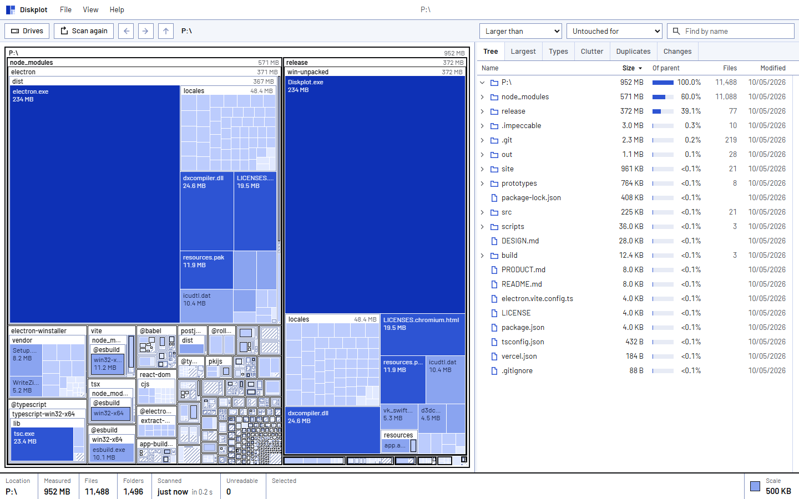

# Diskplot

See what is filling your disk. Diskplot scans a drive or a folder on Windows and shows the result two ways at once: a treemap on the left, a sortable tree on the right. Point at a block and its row lights up. Pick a row and its block is outlined.



It is free, MIT licensed, and has no account, no ads and no telemetry.

[Website](https://diskplot.vercel.app/) · [Download](https://github.com/rodrigokiller/diskplot/releases/latest) · [Em português](https://diskplot.vercel.app/pt/)

## Why another one

I have used SpaceSniffer for years for its map and WizTree for its tree, usually both in the same afternoon. Diskplot is the two views in one window, plus a few things I kept wishing for:

- **Changes.** Each scan leaves a small snapshot. Scan the same place again later and you get a list of what grew, what is new and what is gone.
- **Clutter.** `node_modules`, build output, package manager caches, virtual environments, temp folders and browser caches are recognised and totalled.
- **Find.** Search by name across the whole scan as you type, and narrow by minimum size, age or file type.
- **Duplicates.** Files of equal length are compared by content, on request.

The map uses one colour on purpose. Darker means a bigger share of what you are looking at, and that is the only thing the colour says.

## What it does not do

- It does not read the NTFS master file table. WizTree does, and is faster for it. Diskplot walks folders, which is slower but needs no administrator rights.
- It does not clean anything by itself. Removing is always your click, with a confirmation, and goes to the Recycle Bin.
- It does not run on macOS or Linux yet.
- A file with several hard links is counted once per name, so folders like `WinSxS` look larger than they are.

## Speed

Two runs on my Windows 11 desktop, file cache warm, version 0.1.0:

| Scanned | Files | Folders | Time |
| --- | ---: | ---: | ---: |
| A folder of source code projects | 634,060 | 67,152 | 1.9 s |
| A whole user profile | 2,148,709 | 574,860 | 10.0 s |

A first scan after boot is slower. Antivirus software that inspects every folder open slows it further.

## Sizes

Diskplot shows the space a file occupies on disk, which is what Windows calls "size on disk". Compressed files, sparse files and OneDrive files that are online only count for what they actually take. Duplicate detection uses the real length in bytes.

## Using it

| | |
| --- | --- |
| Open a folder in the map | double click, or Enter in the tree |
| One level up | Backspace, or scroll down over the map |
| One level in | scroll up over the map |
| Find | Ctrl+F |
| Scan a folder | Ctrl+O, or drop a folder on the window |
| Scan again | F5 |
| Send to Recycle Bin | Delete |
| Copy path | Ctrl+C |

Right click anything for Open, Show in Explorer, Copy path and Send to Recycle Bin. The interface is in English and Brazilian Portuguese (View, Language).

## Building from source

You need Node.js 22 or newer on Windows.

```
git clone https://github.com/rodrigokiller/diskplot
cd diskplot
npm install
npm run dev
```

`npm run dist` builds the installer and a portable executable into `release/`.

## How it works

Diskplot is an Electron app written in TypeScript and React.

The scan runs outside the interface, in a coordinator thread with one worker per core. On Windows each worker lists a folder in bulk through `GetFileInformationByHandleEx`, called with [koffi](https://koffi.dev). One call returns hundreds of entries with their sizes, so no file is opened one at a time. Elsewhere it falls back to `readdir` and `lstat`.

The result is not a tree of objects. It is a handful of typed arrays (parent, size, flags, name offsets) with every name in a single UTF-8 buffer, about 60 bytes per file. That is what lets a scan of a few million files move between threads without being copied piece by piece, and what keeps search fast: a name query is one native substring search over that buffer.

The treemap is a squarified layout drawn on a canvas. Its cost depends on the number of pixels, not the number of files, because anything too small to draw is folded into a hatched cell.

Junctions and symbolic links are listed but never followed. Paths longer than 260 characters work. A folder that cannot be read is counted and listed under Unreadable instead of stopping the scan.

```
src/main        window, scan coordinator, folder workers, snapshots, duplicate hashing
src/preload     the typed bridge between the two
src/renderer    interface, treemap, tree, analysis
src/shared      types used by both sides
site            the landing page, plain HTML and CSS
```

## Roadmap

- Optional master file table reader for NTFS when running as administrator
- Hard link awareness
- Export of a scan to CSV
- macOS and Linux builds
- winget package

## Contributing

Bug reports with the folder layout that triggered them are the most useful thing you can send. Open an [issue](https://github.com/rodrigokiller/diskplot/issues). Pull requests are welcome; please keep the interface square, quiet and in one colour.

## License

MIT. See [LICENSE](LICENSE).
